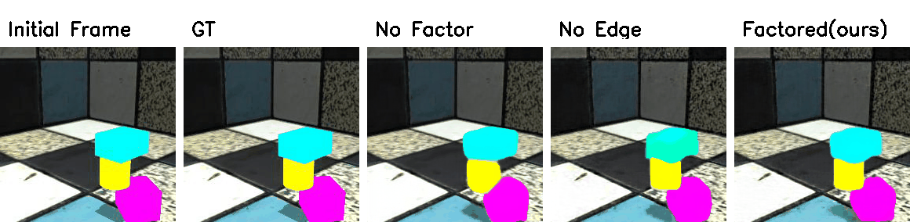
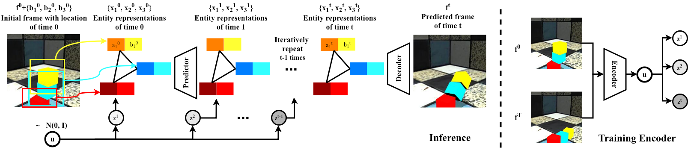

# Compositional Video Prediction
Yufei Ye,    Maneesh Singh,    Abhinav Gupta*, and   Shubham Tulsiani*
   
[Project Page](https://judyye.github.io/CVP/), [Arxiv](http://arxiv.org/abs/1908.08522) 


Given an initial frame, the task is to predict the next few frames in pixel level. The key insight is that a scene is comprised of distinct entities that undergo joint motions.
To operationalize this idea, we propose **Compositional Video Prediction** (CVP), which consists of three main modules:
1) **Entity Predictor**: predicts per-entity representation;
2) **Frame Decoder**: generate pixels given entity-level representation;
3) **Encoder**: generate latent variables to account for multi-modality.     



They jointly give us highly encouraging results compared to baseline methods as shown above. 

This code repo is a re-implementation of the ICCV19 paper [Compositional Video Prediciton](arxive.link). The code is developed based on [Pytorch](https://pytorch.org/) framework. 
It also integrates [LPIPS](https://github.com/richzhang/PerceptualSimilarity) for quantitative evaluation.
    

## Citation
If you find this work useful, please use the following BibTeX entry.

```
@article{ye2019cvp,
  title={Compositional Video Prediction},
  author={Ye, Yufei and Singh, Maneesh  and Gupta, Abhinav and Tulsiani, Shubham},
  year={2019},
  booktitle={International Conference on Computer Vision (ICCV)}
}
```

## Setup Repo
The code was developed by Python 3.6 and PyTorch 0.4.

`git clone git@github.com:JudyYe/CVP.git`


## Demo: Predict video with pretrained model
```
mkdir -p models/ && wget -O models/ours.pth -L https://www.dropbox.com/s/p8y4p8xngoh467y/ours.pth?dl=0 
python demo.py --checkpoint models/ours.pth 
``` 

The  command above downloads our pretrained model. Then  it hallucinates several videos (due to uncertainty) for each image under `examples/`.
It should generates results similar to one column of [the one](https://judyye.github.io/CVP/src/encBest1.gif) in our website. Each row corresponds to one possible future.  Please note:
1.  You can download other pretrain-models including baselines from [here](https://drive.google.com/open?id=1MLst8jBHCyR7_GOg7kCbsSJ25rz8B72R).   
2. Feel free to add flag `--test_mod multi_${N}` to generate `N` number of  diverse futures. 
```
python demo.py --checkpoint ${MODEL_PATH} --test_mod multi_2
```

## Set up Dataset
Before training models on your own or evaluating them quantitatively, you need to set up dataset first. 
In the paper, results on two datasets are provided: the synthetic dataset [Shapestacks](https://shapestacks.robots.ox.ac.uk) and [PennAction](https://dreamdragon.github.io/PennAction/).  

For a quick setup of ready-to-go data for Shapestacks, download and link to `data/shapestacks/`
```
 cd ${FOLDER_TO_SAVE_DATA}
 wget -O ss3456_render.tar.gz -L https://www.dropbox.com/s/6jllu13yqwrnql8/ss3456_render.tar.gz?dl=0 && tar xzf ss3456_render.tar.gz 
 ln -s ${FOLDER_TO_SAVE_DATA}/shapestacks data/shapestacks
```  
 

Please read [`Dataset.md`](docs/Dataset.md) for further explanation about data format together with how to generate and preprocess the data.
  

## Quantitative Evaluation
The best scores among K (K=100) samples are recorded. (See paper for further explanation.) 
The quality of frame is evaluated based on code repo [LPIPS](https://github.com/richzhang/PerceptualSimilarity).
```
python test.py --checkpoint ${PATH_TO_MODEL} --test_mod best_100 --dataset ss3
```
The models are trained with 3 blocks in Shapestacks. Substitute `ss3` with `ss4`  (or `ss5`, `ss6`) to evaluate how model generalizes to more blocks: 
```
python test.py --checkpoint ${PATH_TO_MODEL} --test_mod best_100 --dataset ss4
```

## Train your own model
The model and logs will be saved to `output/`. To train our model, simply run 
```angular2
python train.py --gpu ${GPU_ID}
```

We have provided code to reimplement baselines to ablate predictor, decoder, and encoder correspondingly.
Please see [`Baseline.md`](docs/Baseline.md) for further details. 
 
